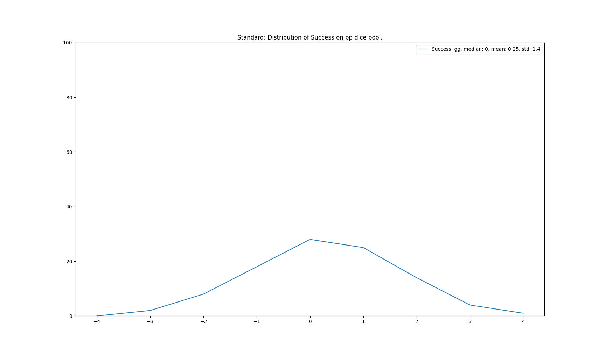
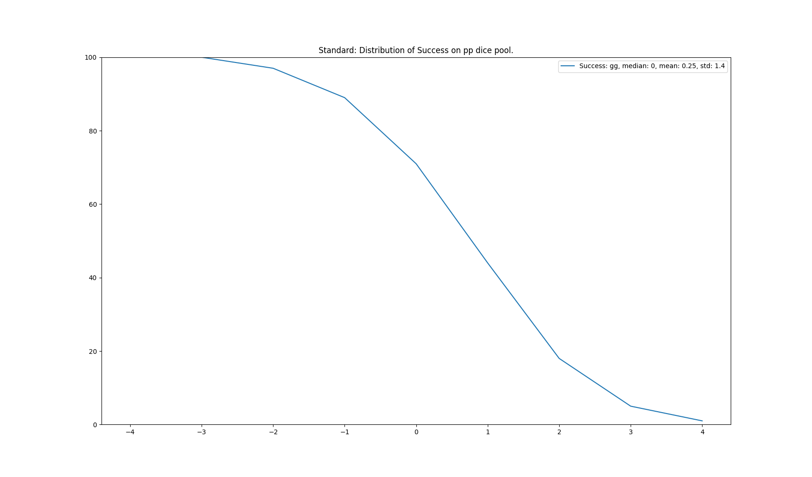
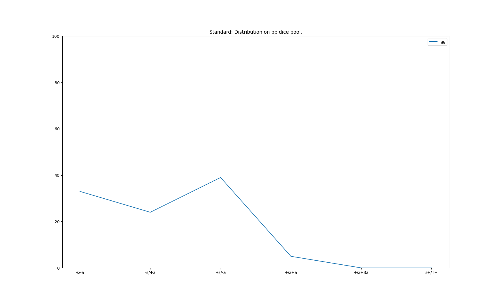
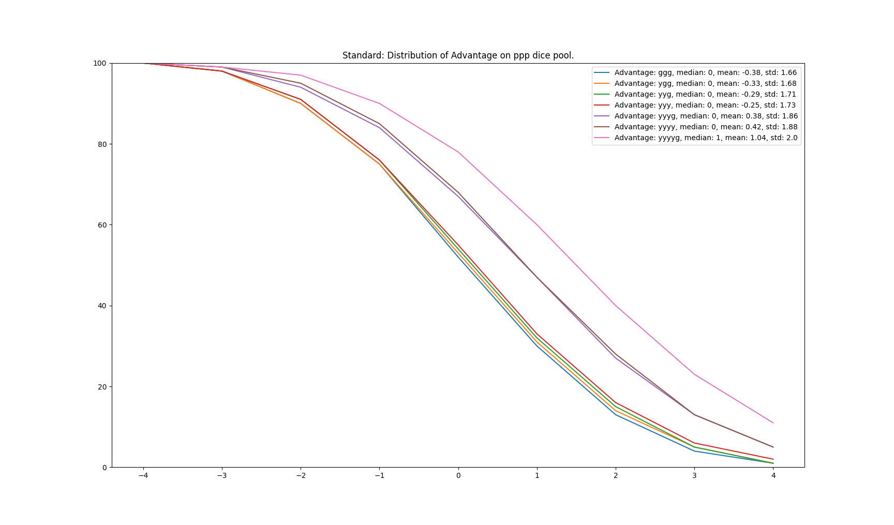
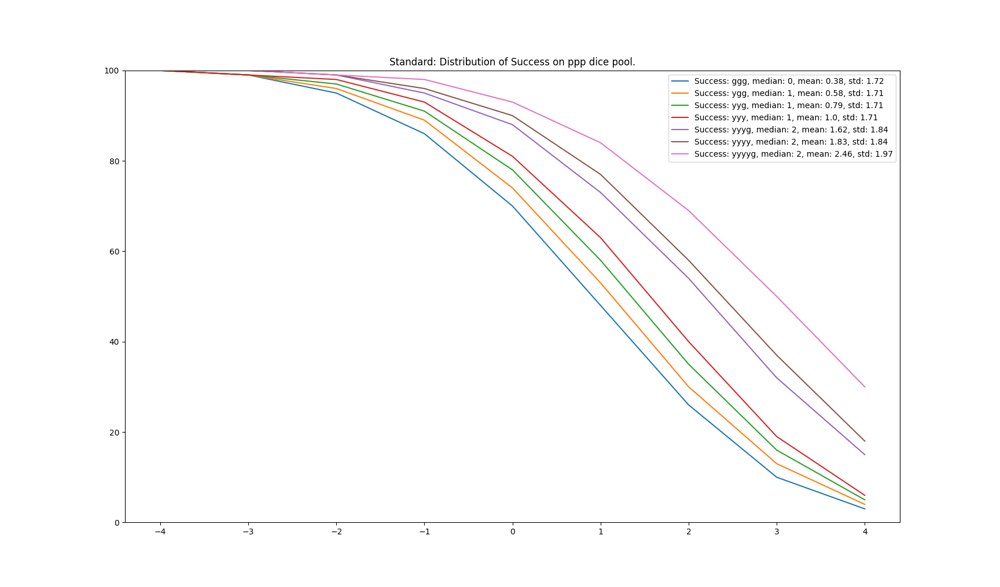
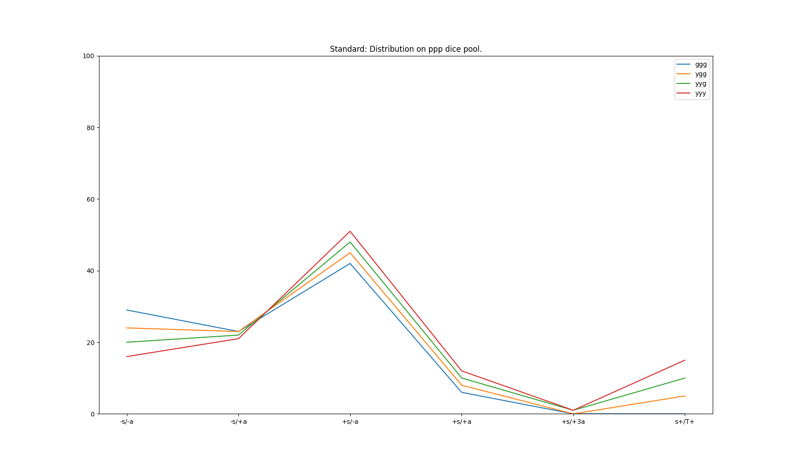

# Ameliorer le systeme de dées de Star Wars FFG ?

J'aime ce systeme, j'aime l'aspect narratif et le fait d'avoir des dés spécifique qui représente differentes facettes des evenements de notre univers.

Pourtant à l'usage, j'ai l'impression que certaines promesses ne sont pas tenus, et que cela n'est pas juste, ni pour les joueurs, ni pour les MJ, c'est pourquoi nous allons décorticer en détails tout ca.

> [!Caution]
> Chacun est différent, nous avons tous des attentes particulière face au jdr, les informations qui vont suivrent reflètes ma propre vision du jeu de role, avec un bon bout de philosophie de comptoir. Vous trouverez ici [1](https://ttftcuts.github.io/sw_dice/),[2](https://illuminatinggames.wordpress.com/2014/09/19/star-wars-age-of-rebellion-a-deep-dive-on-dice-probabilities/),[3](http://rpg-design.wikidot.com/evaluation),[4](https://github.com/johnthagen/eote-dice),[5](https://web.archive.org/web/20160522070459/http://maxmahem.net/wp/star-wars-edge-of-the-empire-die-probabilities/) l'ensemble des travaux deja effectuer par la communauté, que je remercie chaleureusement.
> L'écriture n'est pas ma compétence principal, j'espère que ce qui vas suivre ne serat pas trop indigèste.

# Introduction

Dans cette article nous allons voir qu'il n'y a aucun système parfait dans l'absolu, ce que je rechèrche c'est un système qui soutient l'intention des créateurs, l'ambiance, et le plaisir de jeu!

Pour cela nous allons analyser en détails le système de dés pour voir comment celui ci s'intègre a la narration.

> [!Important]
> Nous allons aborder ici des probabilités et quelques concepts mathématique, selon moi c'est essentiel dans cette phase de design/reflexion car tout système, qu'on le veuille ou non est purement un concept mathématique. Cependant, la beauté selon moi réside dans le fait que toutes ces mathématiques forment un socle necessaire, mais qui s'éffaceras pendant la partie pour faire briller la narration. [6](https://www.scientificamerican.com/article/is-the-universe-made-of-math-excerpt/)

## Nos attentes

Nos décision sont souvent basé sur une interpretation intuitive de nos chance de réussite, notre cerveau arbitre en parmanence le reel pour faire des choix.

Ce concept est selon moi extremement important et doit se retrouver dans le jdr. Dans le monde reel connaissant mes capacités physique je sais estimer si j'ai de bonnes chances de gagner un bras de fer contre mes amis lors d'un paris.

Mon cerveau arbitre la situation, peut-etre certaines circonstance augmente mes chances de reussite? mon amis étant certe plus musclé, mais surtout très ivre aujourd-hui.

Il y'a deux choses interessante:
- Nous faisons cet arbitrage tout le temps, et c'est je pense intrasèque aus espèces `intelligente` et a leur fonctionnement intuitif pour ne pas avoir a tout "conscientiser" et économiser des resources.
- Notre cerveau est un faux amis, et il n'est pas extremement précis a cette tache.

Bien que je puisse estimer mes chances de réussite, même en étant confiant a 90%, il reste ces 10% d'echec. Il reste également tout ce dont je n'avais pas connaissance et qui a pu biaier mon estimation.

Chaque fois que l'on prend une décision, cela est facteur de notre estimation des *chance de réussite*, ainsi que du *risque* en cas d'echec, et du *résultat* de succès.

Chance de réussite, risque et résultat sont d'ailleurs très bien représenté conceptuellement avec nos difrérentes couleurs de dés!

## Un système doit etre juste

Avec la petite réfléxion ci-dessus nous pouvons définir le concept de justesse d'un jeu de role.

> [!IMPORTANT]
> un système juste, est un système dans lequel un joueur *sait* estimer ses chances de réussites pour prendre les meilleurs décisions. C'est également un système cohérent qui collent aux attentes et interpretation intuitive des evenements de l'univers.

Ce concept est très différent de la difficulté intrasèque. Par example dans un JDR zombie, même si je suis un athlète, mes chances de me faufilé dans une horde de zombie sont faible.

Cela fait sens car l'objectif et l'ambiance sont bien spécifique et on veux ressentir la peur et le danger, nos personnages ne sont pas necessairement des héros aux capacités hors du commun.

Dans star wars l'introduction du livre de règle nous précise que l'on vas chercher l'epic! les actions grandiose et les cabrioles à la caméra! Et nous ne souhaitons pas (selon moi) que ce même jet puisse entrainer une mort définitive.

Dans les deux cas je dois être en mesure d'estimer mes chances de réussites, cela ne veux pas dire que mon estimation est correcte 100% du temps, mais cela dois fonctionner en moyenne, être *juste* pour les joueurs et leur prise de décision

Je ne sais pas si ce texte fait bien transparaitre mes pensées, mais c'est la pierre angulaire des idées qui vont suivrent et *tout* est basé la dessus. En conséquence, si vous n'etes pas dacord avec ceci vous risquez de trouver le reste absurde.

## Dés, evenements et probabilité

Dans ce chapitre nous allons observer certains scénario (pool de dés) pour etudier les probabilités et voir si cela correspond a ce que nous attendons, voir si cela nous semble juste et équilibrer. Cet exercice est un peu difficile si pris séparrément, le plus interessant interviendras lorsque nous comparerons différents pool de dés entre eux.

### Distribution

Avant de regarder en détails les scénario, voyons ensemble les différents types de graphiques et comment ils se lisent

#### Distribution Standard de symboles

<details>
<summary>Ces bulles de textes refermables contiennent la commande pour generer le graph, cela n'est pas interessant pour la plupart des lecteurs</summary>

```sh
   python3 eote_dice.py -p ggpp plot single -s s
   # -p pool de dés
   # plot commande pour afficher le graph
   # single, une ligne par symbol, 1 graph par pool
   # -s s, symbol a afficher, s pour success (s,a,T,D)
```
</details>



L'axe du bas nous indique le nombres de symbole (ici des succès) et les points de la courbe nous montre la probabilité d'obtenir ce nombre de symbol.

Dans notre cas présent avec deux dés vert deux dés violet, la probabilité d'obtenir *exactement* 1 succès est de 25%.

Les valeur des probabilités sont interessante, mais c'est également la forme de la courbe qui nous donne énormément d'information, que nous verrons plus tard.

> [!Caution]
> nous avons toujours un nombre entier de Symbol. 0 ou 1 ou 2. il est impossible d'avoir un demi (0,5) symbol. Le format de la courbe ci dessus ne représente pas très bien cela, mais c'est le plus lisible lorsqu'nous allons ajouter plusieurs lignes.

#### Distribution Cumulés de symboles

<details>
<summary>Commande</summary>

```sh
   python3 eote_dice.py -a -p ggpp plot single -s s
   # -a, above, active le mode de probabilité cumulé
```
</details>



Ici nous avons des probabilités cumulés, c'est à dire que la probabilité en un point, corréspond aux probabilités d'obtenir 1 *ou plus* de success, c'est très interessant car dans le système star wars, cela nous dis quel sont nos chances de reussir l'action

Ici la probabilité d'avoir 1 succès net est de 44%.

#### Distribution spécial

Dans le systeme star wars il y'a 4 grand type de résultat de dés

- Echec sans avantage (pas de succès net et pas d'avantage net. noté s-/a-)
- Echec avec avantage (pas de succès net et au moins un avantage net. noté s-/a+)
- Success sans avantage (au moins un Succès net et pas d'avantage net. noté s+/a-)
- Success avec avantage (au moins un succès net et au moins un avantage net. noté s+/a+)
- Success avec 3+ avantage (cas spécial interessant pour activer certains attributs d'armes. noté S+/+3a)
- Success avec au moins un triomphe (noté s+/T+)

<details>
<summary>Commande</summary>

```sh
    python3 eote_dice.py -p ggpp plot combined
   # combined, sous commande de plot, pour afficher ces 5 type de résultat.
```
</details>



Ici l'affichage montre la probabilité de chacun des cas spéciaux, ce seras particulièrement interessant pour comprendre le "transfert" de probabilité lors d'une modification du pool de dés.

### Le patient 0.

J'arrive après la bataille car beaucoup d'articles ont déja débatus et montré les limites du système(TOTO LINK).Cependant, en jouant avec les pool de dés, voici le graph qui m'a donné envie de pousser le raisonnement plus loin.

<details>
<summary>Commande</summary>

```sh
    python3 eote_dice.py -p gggppp -a plot -u 6 single -s a
   # -u, nombres d'upgrade à faire
```
</details>



Ici nous affichons les probabilités cumulés d'avantages, en partant d'un pool de 3 vert 3 violet, et en faisant 6 améliorations.

Informations interessantes:

> [!Important]
> - entre 3 vert et 3 jaunes, il n'y a *aucune* différences significatives sur le nombres d'avantages.
> - ajouter un dés, augmente significativement les chances d'avantages, c'est le gap entre les groupes de ligne.
> - la probabilité d'avoir au moins 3 avantages est relativement faible(surtout qu'ici cela peut-etre sans succès, on ne parle que des avantages)

Continuons avec le même graphe sur la distribution des succès.

<details>
<summary>Commande</summary>

```sh
    python3 eote_dice.py -a -p gggppp -a plot -u 6 single -s s
```
</details>



> [!Important]
> - une amélioration de dée ajoute 5% de chance d'avoir au moins un succès net. (équivalent a +1 en système dnd)
> - une amélioration peut être faite grace a un point de destin.
> - on obsèrve encore le gap de *+10%* lors de l'ajout d'un dé vert.

Ces informations bien qu'interessante ne sont pas des reproches, encore une fois tout est question d'attente et d'équilibre, nous pouvons néanmoins nous poser la question, est-ce que cela nous semble juste et cohérent?

Nous pouvons continuer avec nos cas spéciaux, avec seulement 3 upgrade pour plus de clareté.

<details>
<summary>Commande</summary>

```sh
    python3 eote_dice.py -p gggppp -a plot -u 3 combined
   # -u, nombres d'upgrade à faire
```
</details>



> [!Important]
> avec 3 jaune et 3 violet:
> - *12%* de chance d'avoir au moins 1 succes et 1 avantages.
> - *1%* de chance d'avoir au moins 1 succes et 3 avantages.
> - *15%* de chance d'avoir au moins 1 succes et 1 triomphe.
> - Il y'a donc plus de chance de succes "critique" que de succes avec 1 avantage.

<!-- TODO relire règles sur triple avantage dans les attributs d'armes -->

#### Patient 0 conclusion

Sortons un peu des chiffres pour expliquer conceptuellement ce que nous venons de voir.

> [!Important]
> - Acheter des rangs de compétences n'augmente pas nos chances de succès significativement.
> - Acheter des rangs de compétences n'augmente pas nos chances d'avantage significativement.
> - Acheter des rangs de compétences augmente drastiquement nos chances de triomphe.

> [!Note]
> Les points remontés ci-dessus on été discuté en détails sur ces posts [2](https://illuminatinggames.wordpress.com/2014/09/19/star-wars-age-of-rebellion-a-deep-dive-on-dice-probabilities/),[7](https://www.reddit.com/r/swrpg/comments/5rnr35/deep_dive_into_dice_probabilities/)

Pour résumer les articles linké et ce que nous venons de voir, améliorer un dée en jaune n'offre que des chances de triomphe, pour certaines compétences comme medecine cela peut-être intéréssant, mais en **moyenne** votre personnage ne réussiras pas beaucoup mieux.

Conceptuellement cela me gène, car l'experience des compétences symbolisé par les dés jaune (principalement) devrais dans mon interpretation intuitive, fournir de plus grande chance de succès ou peut-être, moins de chance que les choses ce passent mal, c'est à dire, plus d'avantage ?

Il y'a d'autre choses à prendre en compte que nous verrons plus tard mais cela représente déja un bon terrain de réfléxion et on touche ici le coeur de l'équilibrage et surtout le coeur des attentes personnels que je décrivais plus haut (et qui sont très bien définis ici [3](http://rpg-design.wikidot.com/evaluation))

#### Ajouter des dés

Une des remarques, que l'on a déja un petit peu observé est le fait qu'ajouter des dés semble toujours bien supérieur en tèrme de reussite moyenne.

Regardons ça avec les dés bleu de Boost.

#### L'impact des dés bleu, et l'incohérence de l'usage du triomphe.

Dans les règles il y'a plusieurs facon d'obtenir un dée bleu:

- Dépenser un avantage lors d'un test, pour donner un dée bleu au personnage suivant (valabe pour plusieurs avantages)
- viser
- TODO autre ?

Pour obtenir un dée jaune cependant, seul le point de destin et depenser un triomphe (TODO verifier)


