# Améliorer le système de dés de Star Wars FFG ?

J'aime ce système, j'aime l'aspect narratif et le fait d'avoir des dés spécifiques qui représentent différentes facettes des événements de notre univers.

Pourtant à l'usage, j'ai l'impression que certaines promesses ne sont pas tenues, et que cela n'est pas juste, ni pour les joueurs, ni pour les MJ, c'est pourquoi nous allons décortiquer en détails tout cela et peut-être proposer un nouveau système compatible avec les règles mais ajusté, ou en tout cas permettre aux MJ de mieux équilibrer leurs scénarios.

> [!Caution]
> Chacun est différent, nous avons tous des attentes particulières face au JdR, les informations qui vont suivre reflètent ma propre vision du jeu de rôle, avec un bon bout de philosophie de comptoir. Vous trouverez ici [1](https://ttftcuts.github.io/sw_dice/),[2](https://illuminatinggames.wordpress.com/2014/09/19/star-wars-age-of-rebellion-a-deep-dive-on-dice-probabilities/),[3](http://rpg-design.wikidot.com/evaluation),[4](https://github.com/johnthagen/eote-dice),[5](https://web.archive.org/web/20160522070459/http://maxmahem.net/wp/star-wars-edge-of-the-empire-die-probabilities/) l'ensemble des travaux déjà effectués par la communauté, que je remercie chaleureusement.
> L'écriture n'est pas ma compétence principale, j'espère que ce qui va suivre ne sera pas trop indigeste.

# Introduction

Dans cet article nous allons voir qu'il n'y a aucun système parfait dans l'absolu, ce que je recherche c'est un système qui soutient l'intention des créateurs, l'ambiance, et le plaisir de jeu !

Pour cela nous allons analyser en détails le système de dés pour voir comment celui-ci s'intègre à la narration et quelles sont ses limites.

> [!Important]
> Nous allons aborder ici des probabilités et quelques concepts mathématiques, selon moi c'est essentiel dans cette phase de design/réflexion car tout système, qu'on le veuille ou non est purement un concept mathématique. Cependant, la beauté réside dans le fait que toutes ces mathématiques forment un socle nécessaire, mais qui s'effacera pendant la partie pour faire briller la narration. [6](https://www.scientificamerican.com/article/is-the-universe-made-of-math-excerpt/)

## Nos attentes

Nos décisions sont souvent basées sur une interprétation intuitive de nos chances de réussite, notre cerveau arbitre en permanence le réel pour faire des choix.

Ce concept est selon moi extrêmement important et doit se retrouver dans le JdR. Dans le monde réel connaissant mes capacités physiques je sais estimer si j'ai de bonnes chances de gagner un bras de fer contre mes amis lors d'un pari.

Mon cerveau arbitre la situation, peut-être certaines circonstances augmentent mes chances de réussite ? Mon ami étant certes plus musclé, mais surtout très ivre aujourd'hui.

Il y a deux choses intéressantes :
- Nous faisons cet arbitrage tout le temps, et c'est intrinsèque aux espèces « intelligentes » et à leur fonctionnement intuitif pour ne pas avoir à tout « conscientiser » et économiser des ressources.
- Notre cerveau est un faux ami, et il n'est cependant pas extrêmement précis à cette tâche.

Bien que je puisse estimer mes chances de réussite, même en étant confiant à 90%, il reste ces 10% d'échec. Il reste également tout ce dont je n'avais pas connaissance et qui a pu biaiser mon estimation.

Chaque fois que l'on prend une décision, cela est fonction de notre estimation des *chances de réussite*, ainsi que du *risque* en cas d'échec, et du *résultat* de succès.

Chances de réussite, risque et résultat sont d'ailleurs très bien représentés conceptuellement avec nos différentes couleurs de dés !

## Un système doit être juste

Avec la petite réflexion ci-dessus nous pouvons définir le concept de justesse d'un jeu de rôle.

> [!IMPORTANT]
> Un système juste, est un système dans lequel un joueur *sait* estimer ses chances de réussites pour prendre les meilleures décisions. C'est également un système cohérent qui colle aux attentes et interprétations intuitives des événements de l'univers.

Ce concept est très différent de la difficulté intrinsèque. Par exemple dans un JdR zombie, même si je suis un athlète, mes chances de me faufiler dans une horde de zombies sont faibles.

Cela fait sens car l'objectif et l'ambiance sont bien spécifiques et on veut ressentir la peur et le danger, nos personnages ne sont pas nécessairement des héros aux capacités hors du commun.

Dans Star Wars l'introduction du livre de règle nous précise que l'on va chercher l'épique ! Les actions grandioses et les cabrioles à la caméra ! Et nous ne souhaitons pas (selon moi) que ce même jet puisse entraîner une mort définitive.

Dans les deux cas je dois être en mesure d'estimer mes chances de réussites, cela ne veut pas dire que mon estimation est correcte 100% du temps, mais cela doit fonctionner en moyenne, être *juste* pour les joueurs et leur prise de décision.

Je ne sais pas si ce texte fait bien transparaître mes pensées, mais c'est la pierre angulaire des idées qui vont suivre et *tout* est basé là-dessus. En conséquence, si vous n'êtes pas d'accord avec ceci vous risquez de trouver le reste absurde.

## Dés, événements et probabilité

Dans ce chapitre nous allons observer certains scénarios (pool de dés) pour étudier les probabilités et voir si cela correspond à ce que nous attendons, voir si cela nous semble juste et équilibré. Cet exercice est un peu difficile si pris séparément, le plus intéressant interviendra lorsque nous comparerons différents pools de dés entre eux.

### Distribution

Avant de regarder en détails les scénario, voyons ensemble les différents types de graphiques et comment ils se lisent

#### Distribution Standard de symboles

<details>
<summary>Ces bulles de textes refermables contiennent la commande pour generer le graph, cela n'est pas interessant pour la plupart des lecteurs</summary>

```sh
   python3 eote_dice.py -p ggpp plot single -s s
   # -p pool de dés
   # plot commande pour afficher le graph
   # single, une ligne par symbol, 1 graph par pool
   # -s s, symbol a afficher, s pour success (s,a,T,D)
```
</details>

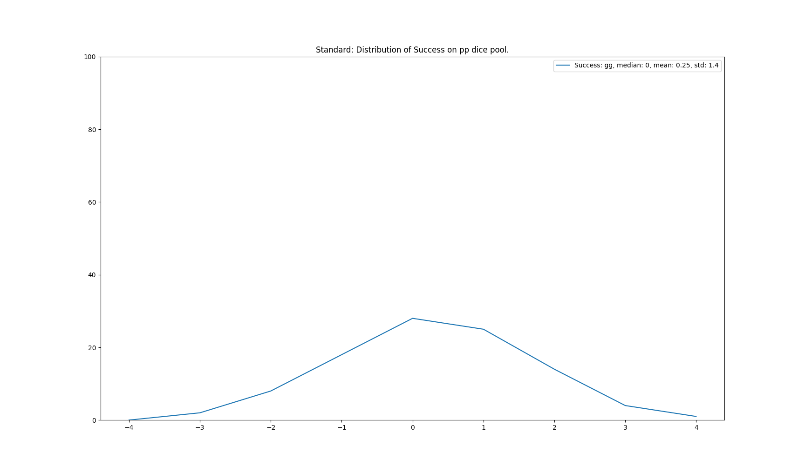

L'axe du bas nous indique le nombres de symbole (ici des succès) et les points de la courbe nous montre la probabilité d'obtenir ce nombre de symbol.

Dans notre cas présent avec deux dés verts et deux dés violets, la probabilité d'obtenir *exactement* 1 succès est de 25%.

Les valeurs des probabilités sont intéressantes, mais c'est également la forme de la courbe qui nous donne énormément d'informations, que nous verrons plus tard.

> [!Caution]
> Nous avons toujours un nombre entier de symboles. 0 ou 1 ou 2. Il est impossible d'avoir un demi (0,5) symbole. Le format de la courbe ci-dessus ne représente pas très bien cela, mais c'est le plus lisible lorsque nous allons ajouter plusieurs lignes.

#### Distribution Cumulés de symboles

<details>
<summary>Commande</summary>

```sh
   python3 eote_dice.py -a -p ggpp plot single -s s
   # -a, above, active le mode de probabilité cumulé
```
</details>

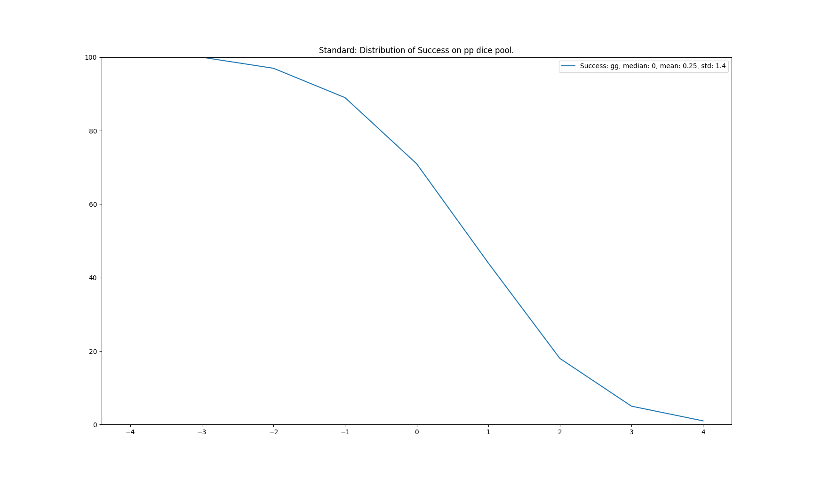

Ici nous avons des probabilités cumulées, c'est-à-dire que la probabilité au point x=1, correspond aux probabilités d'obtenir 1 *ou plus* de succès, c'est très intéressant car dans le système Star Wars, cela nous dit quelles sont nos chances de réussir l'action.

Ici la probabilité d'avoir 1 succès ou plus est de 44%.

#### Distribution spécial

Dans le système Star Wars il y a 4 grands types de résultat de dés :

- Échec **sans** avantage (pas de succès net et pas d'avantage net. noté s-/a-)
- Échec **avec** avantage (pas de succès net et au moins un avantage net. noté s-/a+)
- Succès **sans** avantage (au moins un succès net et pas d'avantage net. noté s+/a-)
- Succès **avec** avantage (au moins un succès net et au moins un avantage net. noté s+/a+)
- Succès **avec** 3+ avantages (cas spécial intéressant pour activer certains attributs d'armes. noté S+/+3a)
- Succès **avec** au moins un triomphe (cas spécial noté s+/T+)

<details>
<summary>Commande</summary>

```sh
    python3 eote_dice.py -p ggpp plot combined
   # combined, sous commande de plot, pour afficher ces 6 type de résultat.
```
</details>

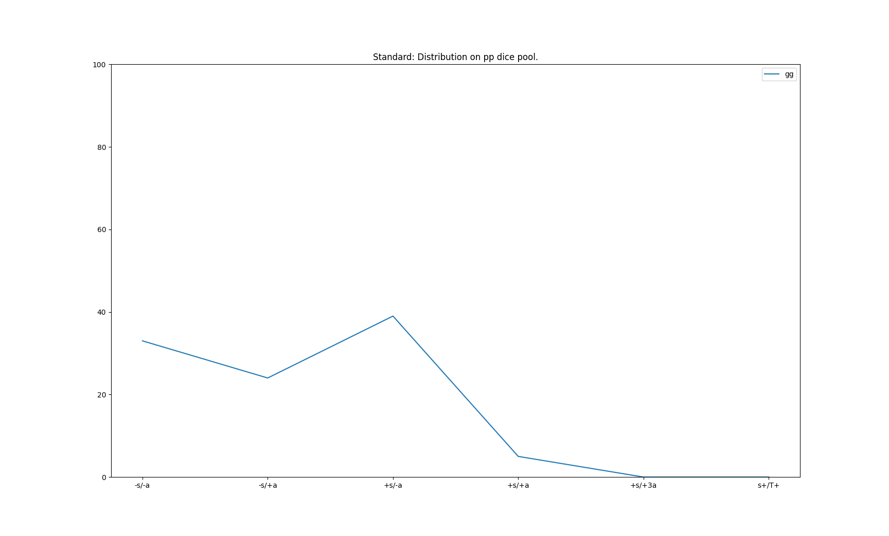

Ici l'affichage montre la probabilité de chacun des cas spéciaux, ce sera particulièrement intéressant pour comprendre le « transfert » de probabilité lors d'une modification du pool de dés.

### Le patient 0 et la courbe d'avantage.

J'arrive après la bataille car beaucoup d'articles ont déjà débattu et montré les limites du système. Cependant, en jouant avec les pools de dés, voici le graphique qui m'a donné envie de pousser le raisonnement plus loin.

<details>
<summary>Commande</summary>

```sh
    python3 eote_dice.py -p gggppp -a plot -u 6 single -s a
   # -u, nombres d'upgrade à faire
```
</details>

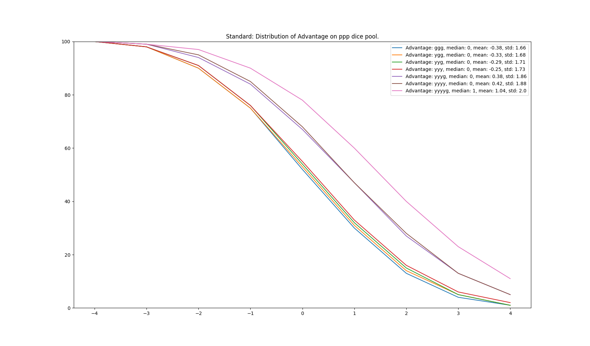

Ici nous affichons les probabilités cumulées d'avantages, en partant d'un pool de 3 verts 3 violets, et en faisant 6 améliorations.

Informations intéressantes :

> [!Important]
> - Entre 3 verts et 3 jaunes, il n'y a *aucune* différence significative sur le nombre d'avantages.
> - Ajouter un dé, augmente significativement les chances d'avantages, c'est le gap entre les groupes de lignes.
> - La probabilité d'avoir au moins 3 avantages est relativement faible (surtout qu'ici cela peut être sans succès, on ne parle que des avantages).

Continuons avec le même graphe sur la distribution des succès.

<details>
<summary>Commande</summary>

```sh
    python3 eote_dice.py -a -p gggppp -a plot -u 6 single -s s
```
</details>

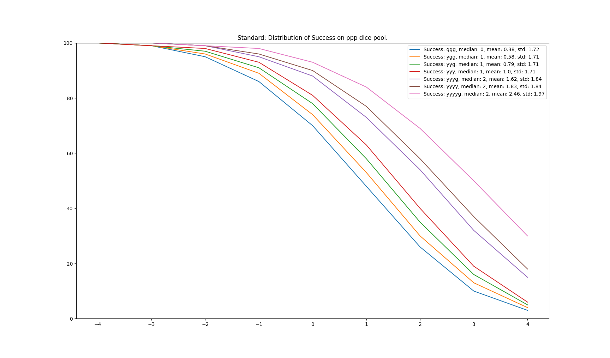

> [!Important]
> - Une amélioration de dé ajoute 5% de chance d'avoir au moins un succès net. (équivalent à +1 en système D&D)
> - Une amélioration peut être faite grâce à un point de destin.
> - On observe encore le gap de *+10%* lors de l'ajout d'un dé vert.

Ces informations bien qu'intéressantes ne sont pas des reproches, encore une fois tout est question d'attente et d'équilibre, nous pouvons néanmoins nous poser la question, est-ce que cela nous semble juste et cohérent ?

Nous pouvons continuer avec nos cas spéciaux, avec seulement 3 upgrades pour plus de clarté.

<details>
<summary>Commande</summary>

```sh
    python3 eote_dice.py -p gggppp -a plot -u 3 combined
   # -u, nombres d'upgrade à faire
```
</details>

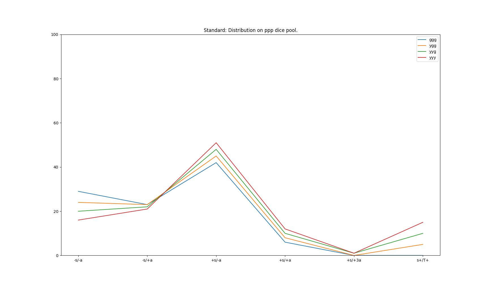

> [!Important]
> Avec 3 jaunes et 3 violets :
> - *12%* de chance d'avoir au moins 1 succès et 1 avantage.
> - *1%* de chance d'avoir au moins 1 succès et 3 avantages.
> - *15%* de chance d'avoir au moins 1 succès et 1 triomphe.
> - Il y a donc plus de chance de succès « critique » que de succès avec 1 avantage.

<!-- TODO relire règles sur triple avantage dans les attributs d'armes -->

#### Patient 0 conclusion

Sortons un peu des chiffres pour expliquer conceptuellement ce que nous venons de voir.

> [!Important]
> - Acheter des rangs de compétences augmente faiblement nos chances de succès.
> - Acheter des rangs de compétences n'augmente pas nos chances d'avantage significativement.
> - Acheter des rangs de compétences augmente significativement nos chances de triomphe.

> [!Note]
> Les points remontés ci-dessus on été discuté en détails sur ces posts [2](https://illuminatinggames.wordpress.com/2014/09/19/star-wars-age-of-rebellion-a-deep-dive-on-dice-probabilities/),[7](https://www.reddit.com/r/swrpg/comments/5rnr35/deep_dive_into_dice_probabilities/)

Pour résumer les articles linké et ce que nous venons de voir, améliorer un dée en jaune n'offre que des chances de triomphe, pour certaines compétences comme medecine cela peut-être intéréssant, mais en **moyenne** votre personnage ne réussiras pas beaucoup mieux.

Conceptuellement cela me gêne, car l'expérience des compétences symbolisée par les dés jaunes (principalement) devrait dans mon interprétation intuitive, fournir de plus grandes chances de succès ou peut-être, moins de chance que les choses se passent mal, c'est-à-dire, plus d'avantages ?

Il y a d'autres choses à prendre en compte que nous verrons plus tard mais cela représente déjà un bon terrain de réflexion et on touche ici le cœur de l'équilibrage et surtout le cœur des attentes personnelles que je décrivais plus haut (et qui sont très bien définies ici [3](http://rpg-design.wikidot.com/evaluation)).

#### Ajouter des dés

Une des remarques, que l'on a déjà un petit peu observée est le fait qu'ajouter des dés semble toujours bien supérieur en terme de réussite moyenne.

Regardons ça avec les dés bleus de Boost.

### L'impact des dés bleu.

Dans les règles il y a plusieurs façons d'obtenir un dé bleu :

- Dépenser un avantage lors d'un test, pour donner un dé bleu au personnage suivant (valable pour plusieurs avantages)
- Viser
- Avoir un avantage environnemental ou externe (peut être demandé par le joueur s'il fait preuve d'inventivité)

Cependant, pour obtenir une amélioration de dé jaune supplémentaire, seuls le point de destin et dépenser un triomphe sont disponibles.

<details>
<summary>Commande</summary>

```sh
    python3 eote_dice.py -C -a -p gggbppp -p ggyppp -p gggppp plot compare -s s
```
</details>

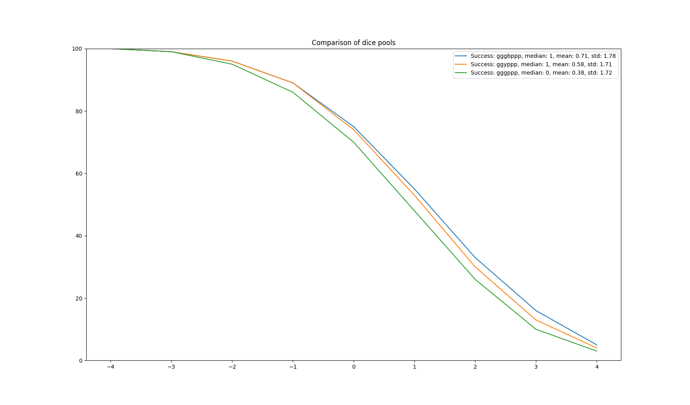

Ici nous voyons qu'ajouter un dé bleu est égal à améliorer un dé en terme de succès cumulé.

<details>
<summary>Commande</summary>

```sh
    python3 eote_dice.py -C -a -p gggbppp -p ggyppp -p gggppp plot compare -s s
```
</details>

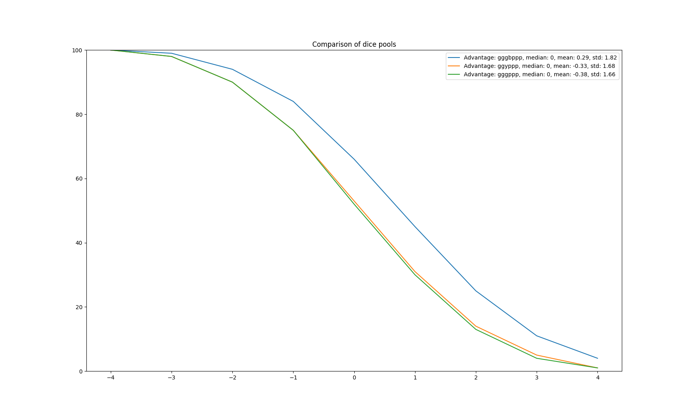

Ici nous voyons qu'ajouter un dé bleu est significativement **meilleur** qu'améliorer un dé jaune en terme d'avantages cumulés.

<details>
<summary>Commande</summary>

```sh
    python3 eote_dice.py -C -a -p gggbppp -p ggyppp -p gggppp plot combined
```
</details>

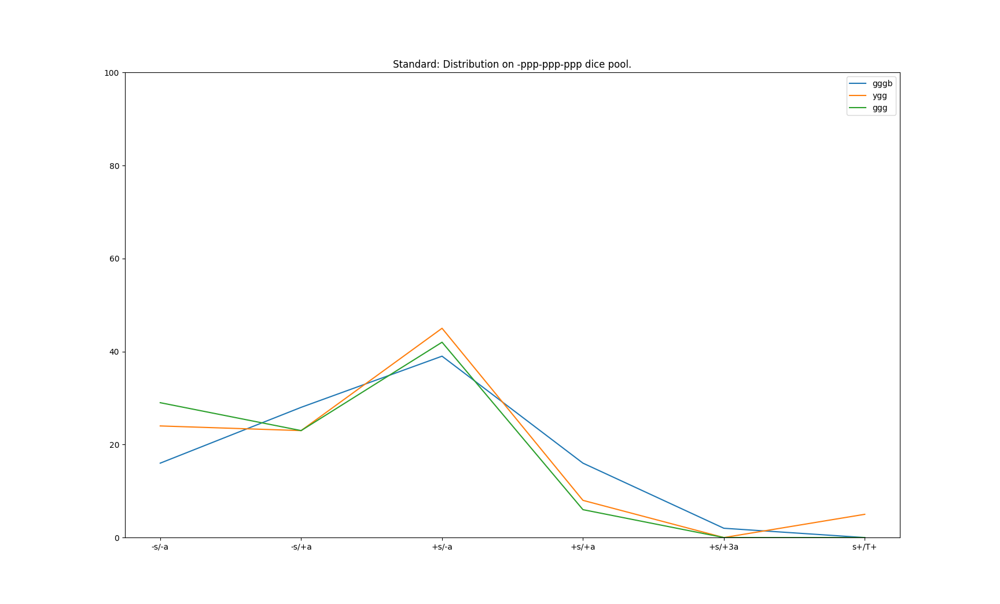

Ici l'impact du dé bleu est très intéressant, il augmente significativement les chances de succès avec avantage et est meilleur dans tous les cas sauf dans le cas du triomphe.

> [!Note]
> Les chances de succès avec triomphe sont de **5%** soit équivalent au 20 dans un système d20.

Utiliser un triomphe pour améliorer un dé n'est pas rentable, vous consommez votre triomphe, qui avait peu de chance de se produire, pour ajouter 5% de chance de triomphe.

Cela se rapproche alors de la confirmation de critique des anciens systèmes D&D, et les probabilités de faire de bons résultats sur des jets successifs sont vraiment mauvaises.

Il est donc vraiment préférable d'utiliser le triomphe pour son aspect libre/narratif.

Les points de destin, qui dans les règles sont censés avoir un gros impact, ne valent pas non plus le coup d'être utilisés pour améliorer des dés, il est toujours préférable d'utiliser leur aspect libre/narratif.

> Nous voyons ici une des premières limites, les dés jaunes sont intéressants mais n'ont pas du tout la puissance qui leur est accordée dans les règles.

> [!Note]
> Biais des tailles de dé : dans un certain nombre de systèmes classiques, nous avons l'habitude de devoir faire de gros chiffres, avec cela plus le dé a de faces, plus il est intéressant, 1d12 est mieux qu'1d6.
> Ici nos dés bleus à 6 faces nous semblent plus faibles que nos dés verts, qui semblent plus faibles que nos dés jaunes, à la fois parce que dans les règles ils sont décrits comme moins impactants, et à cause de ce biais.


### Maxer les compétences à la création de personnages

Un point qui revient régulièrement dans les articles est le fait qu'acheter des points de caractéristique est essentiel et bien supérieur que de choisir des compétences ou des points de talents. En prenant en compte que seule la création de personnage le permet la question est intéressante car elle peut créer de gros désavantages et un sentiment d'injustice dans le groupe sur le long terme.

Prenons l'exemple d'un personnage qui garde sa stat élevée naturelle de trois en Agilité et qui prend deux rangs de pilotage, comparé à un personnage qui choisit de mettre 4 en Agilité et qui n'a aucun rang de pilotage.

<details>
<summary>Commande</summary>

```sh
    python3 eote_dice.py -C -a -p ggggppp -p gyyppp  plot compare -s s
```
</details>

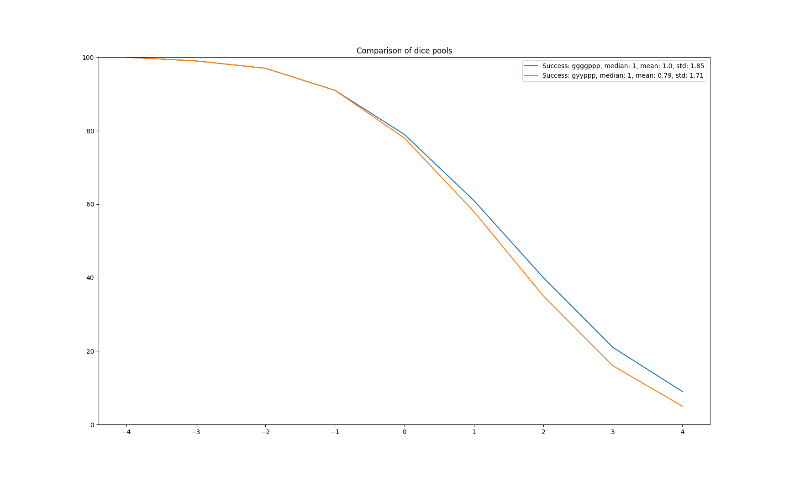

Ici on observe aucune différence significative sur la distribution des succès (voir légèrement supérieur pour le 4 Agilité).

<details>
<summary>Commande</summary>

```sh
    python3 eote_dice.py -C -a -p ggggppp -p gyyppp  plot compare -s a
```
</details>

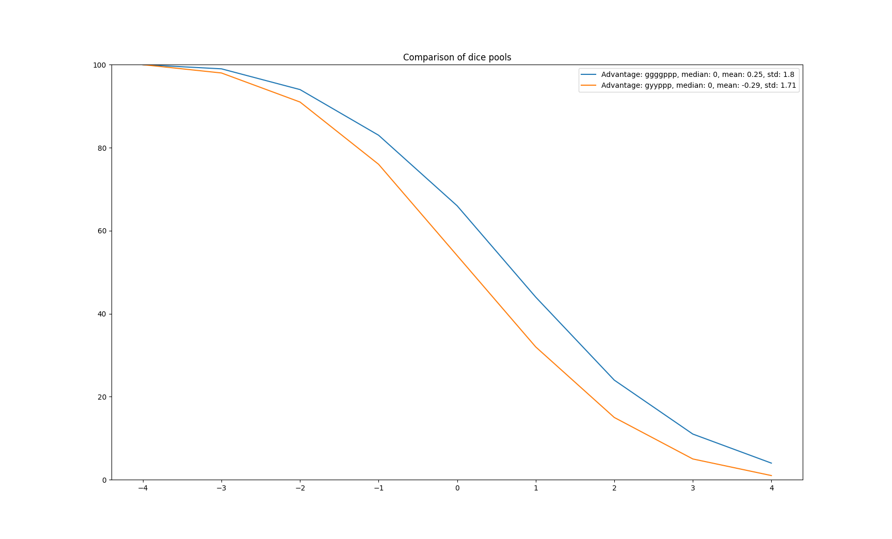

Ici on observe que le 4 d'agilité fournit significativement plus d'avantages.

<details>
<summary>Commande</summary>

```sh
    python3 eote_dice.py -C -a -p ggggppp -p gyyppp  plot combined
```
</details>

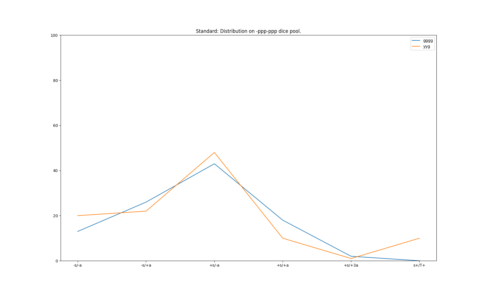

Cette distribution confirme et affine les observations ci-dessus.

> [!Important]
> Deux dés jaunes sont moins bons au global qu'un dé vert, ils apportent quelques chances de triomphe.
> Ici le personnage avec 4 d'agilité est bien meilleur dans quasiment toutes les situations, nous avons regardé compétences vs pas de compétences, mais il est bon de rappeler qu'une caractéristique s'utilise avec 5-10 compétences, ce qui rend la caractéristique vraiment supérieure au global.

Comment interpréter ces résultats ? Selon moi c'est étrange qu'un personnage entraîné ait juste plus de chance d'une réussite miraculeuse exceptionnelle. L'entraînement apporte au contraire une stabilité, une précision, un savoir-faire qui devrait réduire la variance.